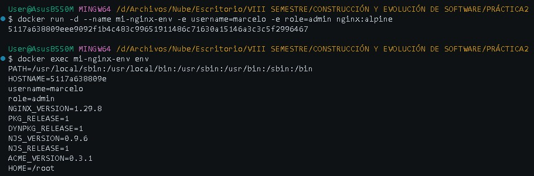

# Variables de Entorno
### ¿Qué son las variables de entorno?
Son valores dinámicos almacenados en el sistema operativo o contenedor que afectan el comportamiento de los procesos en ejecución. En Docker, permiten inyectar configuraciones (como credenciales, puertos o nombres de usuario) en tiempo de ejecución sin necesidad de modificar el código fuente o la imagen base.

### Para crear un contenedor con variables de entorno

```
docker run -d --name <nombre contenedor> -e <nombre variable1>=<valor1> -e <nombre variable2>=<valor2>
```

### Crear un contenedor a partir de la imagen de nginx:alpine con las siguientes variables de entorno: username y role. Para la variable de entorno rol asignar el valor admin.

```
docker run -d --name mi-nginx-env -e username=marcelo -e role=admin nginx:alpine
```

```
docker exec mi-nginx-env env
```


### Crear un contenedor con la imagen de mysql, mapear todos los puertos
```
docker run -d -P --name mi-mysql-falla mysql
```

### ¿El contenedor se está ejecutando?
No. Si verificamos con `docker ps -a`, el contenedor se detiene inmediatamente y aparece con estado `Exited`.

### Identificar el problema
Al no pasarle variables de entorno, la imagen de MySQL detiene su ejecución por seguridad. Al revisar los logs, el sistema indica que se requiere especificar obligatoriamente variables como `MYSQL_ROOT_PASSWORD`, `MYSQL_ALLOW_EMPTY_PASSWORD` o `MYSQL_RANDOM_ROOT_PASSWORD` para inicializar la base de datos.

### Para crear un contenedor con variables de entorno especificadas
- Portabilidad: Las aplicaciones se vuelven más portátiles y pueden ser desplegadas en diferentes entornos (desarrollo, pruebas, producción) simplemente cambiando el archivo de variables de entorno.
- Centralización: Todas las configuraciones importantes se centralizan en un solo lugar, lo que facilita la gestión y auditoría de las configuraciones.
- Consistencia: Asegura que todos los miembros del equipo de desarrollo o los entornos de despliegue utilicen las mismas configuraciones.
- Evitar Exposición en el Código: Mantener variables sensibles como contraseñas, claves API, y tokens fuera del código fuente reduce el riesgo de exposición accidental a través del control de versiones.
- Control de Acceso: Los archivos de variables de entorno pueden ser gestionados con permisos específicos, limitando quién puede ver o modificar la configuración sensible.

### ¿Qué bases de datos existen en el contenedor creado?
Tras crear un contenedor correctamente inicializado con su variable de contraseña:
```
docker run -d -P --name mi-mysql-ok -e MYSQL_ROOT_PASSWORD=admin mysql
```
Las bases de datos creadas por defecto por el sistema son: `information_schema`, `mysql`, `performance_schema` y `sys`.
