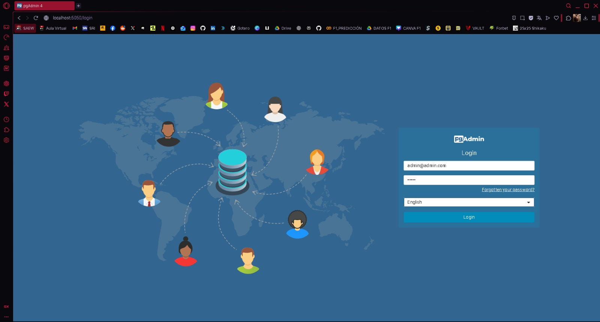
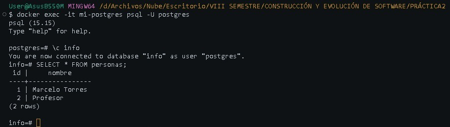

### Crear contenedor de Postgres sin que exponga los puertos. Usar la imagen: postgres:15-alpine3.21
```
docker run -d --name mi-postgres -e POSTGRES_PASSWORD=admin postgres:15-alpine3.21
```

### Crear un cliente de postgres. Usar la imagen: dpage/pgadmin4

```
docker run -d --name mi-pgadmin -p 5050:80 -e PGADMIN_DEFAULT_EMAIL=admin@admin.com -e PGADMIN_DEFAULT_PASSWORD=admin dpage/pgadmin4
```

La figura presenta el esquema creado en donde los puertos son:
- a: 5050 (Puerto host para acceder a pgAdmin)
- b: 80 (Puerto interno del contenedor pgAdmin)
- c: 5432 (Puerto interno del contenedor PostgreSQL)


## Desde el cliente
### Acceder desde el cliente al servidor postgres creado.

### Crear la base de datos info, y dentro de esa base la tabla personas, con id (serial) y nombre (varchar), agregar un par de registros en la tabla, obligatorio incluir su nombre.

## Desde el servidor postgresl
### Acceder al servidor
### Conectarse a la base de datos info
```
\c info
```
### Realizar un select *from personas

