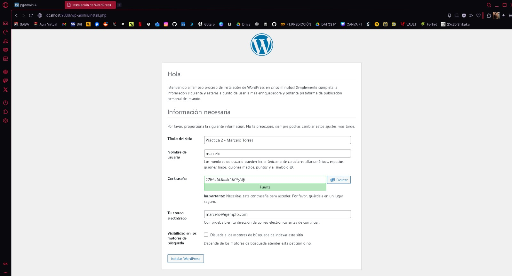
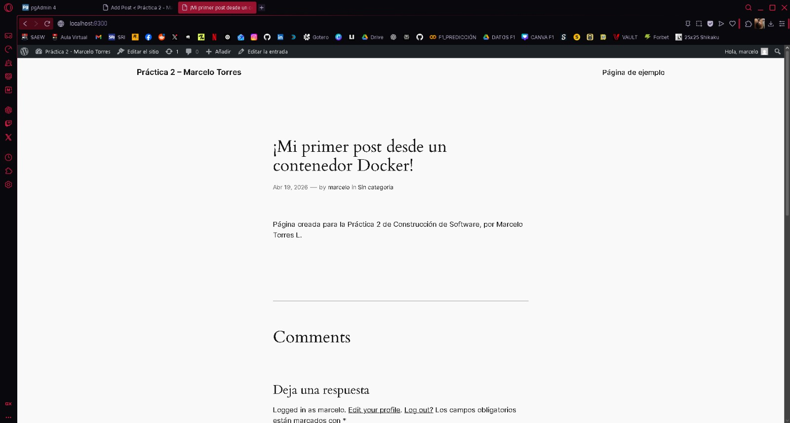

## Esquema para el ejercicio


### Crear la red
```
docker network create net-wp
```

### Crear el contenedor mysql a partir de la imagen mysql:8, configurar las variables de entorno necesarias
```
docker run -d --name db-wp --network net-wp -e MYSQL_ROOT_PASSWORD=admin -e MYSQL_DATABASE=wordpress -e MYSQL_USER=wpuser -e MYSQL_PASSWORD=wppass mysql:8
```

### Crear el contenedor wordpress a partir de la imagen: wordpress, configurar las variables de entorno necesarias
```
docker run -d --name mi-wordpress -p 9300:80 --network net-wp -e WORDPRESS_DB_HOST=db-wp -e WORDPRESS_DB_USER=wpuser -e WORDPRESS_DB_PASSWORD=wppass -e WORDPRESS_DB_NAME=wordpress wordpress
```

De acuerdo con el trabajo realizado, en el esquema del ejercicio el puerto a es **9300**

Ingresar desde el navegador al wordpress y finalizar la configuración de instalación.


Desde el panel de admin: cambiar el tema y crear una nueva publicación.
Ingresar a: http://localhost:9300/ 
recordar que a es el puerto que usó para el mapeo con wordpress


### Eliminar el contenedor wordpress
```
docker rm -f mi-wordpress
```

### Crear nuevamente el contenedor wordpress
Ingresar a: http://localhost:9300/ 
recordar que a es el puerto que usó para el mapeo con wordpress

### ¿Qué ha sucedido, qué puede observar?
Al recrear el contenedor de WordPress y conectarlo a la misma base de datos (que no fue eliminada), el sitio web mantiene toda su configuración, temas y publicaciones. Esto demuestra que la capa de aplicación es efímera, mientras que la persistencia reside en el contenedor de la base de datos.

